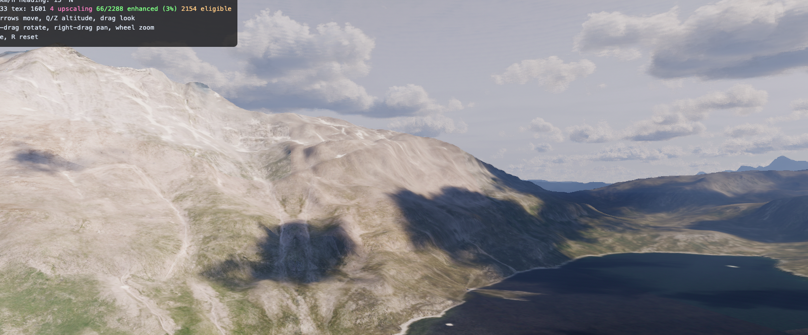

Our 3D Greenland terrain system. Clone the repo, follow the install instructions below, and start exploring — all terrain data (heightmaps and textures) is downloaded automatically as you fly around. No bulk downloads or pre-processing needed.

The front end in /webserver folder is running vite. The entry point is `main.js` → `main.terrain.js`. The SPA uses a heatmap priority approach to determine what tiles/textures to load or drop, and uses [Takram three-geospatial](https://github.com/takram-design-engineering/three-geospatial) for atmosphere and cloud effects. There is a map view (no clouds) to help with navigation and tile debugging.

The backend in /flaskserver manages terrain heightmaps and textures in a SQLite db (terrain.db). It always assumes the user starts from scratch and will rebuild all missing data as needed. FIRST VISIT TO ANY LOCATION WILL BE SLOW — heightmaps and textures are fetched on demand and cached in the DB. Subsequent visits are fast. All tile demand is driven from the frontend heatmap.

Rendered tile seams are cached in `terrain_seam_cache` by the exact normalized physical-edge key `(tile_a, direction, tile_b)`. Same-depth and cross-LOD repairs use the same lookup. Writing new heightmap data deletes every cached seam that names the changed tile on either side, so repaired edges are rebuilt on the next terrain query.

Dataforsyningen imagery is fetched in aligned 4x4 metatiles: the grandparent extent is requested and reprojected once at 1024x1024, source-mosaic color jumps are edge-matched and feathered across internal boundaries, then the result is split into sixteen 256x256 child textures. Older texture sources upgrade on demand to `dataforsyningen_metatile4h2`; one child request fills the whole group.

## Data Sources

| Data | Source | Resolution | Notes |
|------|--------|-----------|-------|
| Heightmaps (primary) | [ArcticDEM v4.1](https://www.pgc.umn.edu/data/arcticdem/) mosaic via S3 | 10m | Cloud Optimized GeoTIFF, free, no auth |
| Heightmaps (fallback) | [Copernicus GLO-30](https://spacedata.copernicus.eu/) via S3 | 30m | Used when ArcticDEM has no coverage |
| Textures | [Dataforsyningen](https://dataforsyningen.dk/) WMS | 0.2m–1.6m | SPOT 6/7 + aerial ortho, requires free API token |
| Labeling reference | Google satellite tiles | ~0.26 m/px (z18) | Classification ground truth only — measured, never shipped |
| Building footprints | [Asiaq Teknisk Grundkort](https://kortforsyning.asiaq.gl/) | surveyed vectors | PolygonZ roof outlines per settlement, ingested via `ingest_buildings.py` |

## Coordinate Systems

| System | EPSG | Used For |
|--------|------|----------|
| NSIDC Polar Stereographic North | 3413 | Internal tile grid, DEM, all spatial queries (meters) |
| WGS84 Lat/Lon | 4326 | API input/output, camera positions, user-facing coords |
| Greenland Transverse Mercator | 3184 | Dataforsyningen WMS requests only |
| WGS84 Ellipsoid + ECEF | — | Three.js 3D rendering, camera, lighting, ENU frames |

**EPSG:3413** is the primary internal system. Everything else converts to/from it.

- `coords.py` handles `to_stereo(lat, lon)` (4326→3413) and `to_wgs84(x, y)` (3413→4326)
- Dataforsyningen textures: 3413 → 3184 for the WMS request, then warped back to 3413 (Lanczos)
- Client-side: lat/lon → `Geodetic` → ECEF for Three.js scene placement

## Texture Pipeline

Real imagery down to depth 12, invented detail below it.

    dataforsyningen (faithful, depth ≤ 12) → procedural synthesis (gorgeous + deterministic, depth ≥ 13)

1. **Bootstrap**: On first run, the server seeds the tile grid as empty skeletons (no heightmaps, no textures). These define the quadtree structure up to the target depth.
2. **tex-worker** fetches from Dataforsyningen WMS (SPOT 6/7 1.6m, EPSG:3184) on demand. If it fails (rate limit, timeout, no coverage), the tile stays uncached and an ancestor texture is cropped and served as a placeholder until the next request retries.
3. Dataforsyningen WMS requires EPSG:3184 (not 3413). The fetch reprojects 3413→3184 for the request, then warps the result back to 3413 with Lanczos resampling.
4. Dataforsyningen runs out of detail around depth 13 (SPOT is 1.6 m/px). Below that, accuracy vs reality stops mattering: **depth 12 already tells us what goes where**. A coarse class map at d12 scale (water / grey / dark slopes & shadows / green / white — see `flaskserver/classifier/storage.py`) is the entire semantic contract.

Coastal terrain uses the `Åbent Land` GTK50 map as its authoritative land/sea
boundary, preferring the **1:50k vector edition** (Dataforsyningen Databoks,
`tidalwater_s` minus `island_s`, sea only — lakes keep their elevation) for any
area whose 100 km blocks have been downloaded into `flaskserver/gtk50_blocks/`
via `ingest_coastline.py <block>|--lat/--lon`; elsewhere it falls back to
decoding the rendered `gl_aabent_land` WMS from `gis.govmin.gl` (set
`COASTLINE_VECTOR=0` to force the fallback everywhere). The raw DEM remains
unchanged in the canonical `tiles.heightmap` payload. An independent mask in
`coastline_masks` is applied to a copy when terrain is read or rendered, and
the classifier uses the same mask to force mapped sea into its water class. This prevents
ArcticDEM/Copernicus artifacts from closing fjords or producing islands in open
water without destroying source elevation samples. The source is served by the
Government of Greenland at `gis.govmin.gl`; ASIAQ's higher-detail technical
coastline remains locality-only and cannot cover the surrounding fjords.

Schema v3 preserves payloads written by the earlier destructive coastline
pipeline, queues those rows for on-demand restoration, and replaces them with
fresh raw ArcticDEM/Copernicus samples as the affected tiles are requested.
5. **Everything below depth 12 is procedural** (work in progress): per-class texture and asset synthesis, seeded from absolute EPSG:3413 coordinates so every visit renders identical detail, color-anchored to the real d12 imagery so the transition doesn't pop. Judged on looks, not fidelity. Google imagery is a labeling/measurement reference only and never ships.

Retired approaches, kept in git history only: bathymetry flattening and learned recoloring from external reference imagery.

The eyeball harness is the **tile inspector** (`pipeline.html?tile=<id>`): a tile's progress through heightmap → southness → texture → procgen, with per-stage status and keyboard navigation across tiles and depths.

Classifier output lives in `terrain.db`'s `classifier_tiles` table as a zlib-compressed, image-oriented `uint8` label raster plus a class-schema name, dimensions, optional confidence raster, source/model identifier, and timestamp. A fresh database contains no classifier rows. In the 3D view, the **gridlines** HUD link toggles cyan terrain-conforming tile boundaries. Gridlines are a single batched line overlay; they do not fetch classifier output, alter imagery, replace textures, or change water rendering.

## Buildings & Roads

Real 3D buildings and texture-painted roads from Asiaq's Teknisk Grundkort (surveyed outlines with per-vertex elevations). Fully automatic: on startup the server downloads any settlement listed in `terrain_config.GRUNDKORT_SETTLEMENTS` (default: Nuuk) from [kortforsyning.asiaq.gl](https://kortforsyning.asiaq.gl/) into `flaskserver/grundkort/` (gitignored), then ingests whatever is missing from the `buildings`/`roads` tables — a fresh clone or a flushed terrain.db repopulates itself. To cover more settlements, add their folder names to that list, or drop a `*_TekniskGrundkort_SHP.zip` into `grundkort/` manually. The manual scripts still work too:

    cd flaskserver
    ./venv/bin/python ingest_buildings.py grundkort/0600NUK_TekniskGrundkort_SHP.zip
    ./venv/bin/python ingest_roads.py grundkort/0600NUK_TekniskGrundkort_SHP.zip

Geometry is reprojected to EPSG:3413. Building ground is sampled from cached heightmaps; buildings ingested before their area's heightmaps exist get a roof-derived estimate (`ground_sampled = 0`) and a background loop re-samples them once heightmaps stream in — ingest order doesn't matter.

`assetserver/assets.db` is the catalog of record for buildings and roads. After ingest, `grundkort.py` syncs both feature types with EPSG:3413 bounds for spatial queries. The viewer only talks to Flask: Flask serves repaired building geometry at `/api/buildings` and paints intersecting road/path centerlines onto a clean copy of every tile texture returned by `/api/texture/<tile>.jpg`. The cached satellite image remains unmodified, so asset edits can be composited again.

## Troubleshooting

- **Tiles not loading?** A hard browser reload (**Cmd+Shift+R** / **Ctrl+Shift+R**) may be needed to force the frontend to re-request tiles from the backend, especially after restarting the server or clearing the DB.

## Default Camera

The camera starts facing north at Nuuk (64.18°N, 51.72°W). Use the clickable **roads** link in the HUD to toggle the red road-texture diagnostic, or **reset** to restore the default view.

## Fly to Tile

Press **T** and enter a tile id (`depth-col-row`, e.g. `12-1461-786`) to teleport the camera to a north-up, near-top-down view centered over that tile, at an altitude where the tile roughly fills the screen. Once the tile's heightmap streams in, the camera auto-lifts to keep the same height above the actual ground (useful over the ice sheet). Starting the app with `?tile=12-1461-786` flies there on boot, overriding the saved camera. Also available from the console as `takramDebug.flyToTile('12-1461-786')`.

## Map Mode

Press **M** to toggle a 2D map view (no clouds/atmosphere) for navigation and tile debugging. Right-click on a tile to inspect its metadata or open it in the tile inspector.

Use the clickable **heatmap** link in the HUD to toggle the live tile-priority heatmap and return directly to 3D. Map and heatmap are separate views: return to 3D before switching between them. Both retain the same heading, pan, and zoom. Regular map mode outlines the terrain meshes currently being rendered as a thin grey grid, with the tile under the pointer outlined in red.

In 3D mode, expand **Scene settings** in the top-right to adjust atmosphere,
cloud, and lighting parameters. The **Water** section's **dynamic water**
checkbox toggles the animated water surface on both renderers (WebGL GLSL and
WebGPU TSL ports of the same FFT sim). (WIP — still working out some bugs.)

Press **G** to open Google Maps' satellite 3D view at the current camera position, heading, tilt, height above ground, and field of view. This is a debugging reference and opens in a new tab.

## Setup

### Prerequisites
- Python 3.13+ with pip
- Node.js 18+

### Backend (Flask)
```bash
cd flaskserver
python -m venv venv
source venv/bin/activate
pip install -r requirements.txt
```

Create a `.env` file in `flaskserver/` with your API token:
```
DATAFORSYNINGEN_TOKEN=<your-token>
```

To get a free token: [create a user account](https://dataforsyningen.dk/) (click "Log ind" → "Opret Profil"), confirm via email, then log in and go to your profile → "Administrer token til webservice og API'er" to generate a token.

Databoks file downloads (`ftps://ftp.dataforsyningen.dk`, implicit TLS on port 990) use your Dataforsyningen account login rather than the token — set `DATAFORSYNINGEN_FTP_USER` / `DATAFORSYNINGEN_FTP_PASS` in `flaskserver/.env`.

### Asset Server (TypeScript + SQLite)

The asset server manages vehicles, structures, and their placement via a SQLite database (`assets.db`). It must be running for vehicles and structures to load in the frontend. Still WIP — schema and endpoints may change.

```bash
cd assetserver
npm install
```

### Frontend (Vite)

The frontend depends on a local clone of the [Takram three-geospatial](https://github.com/takram-design-engineering/three-geospatial) monorepo for atmosphere and cloud effects. Vite aliases `@takram/*` imports to this local source.

```bash
cd webserver
git clone https://github.com/takram-design-engineering/three-geospatial.git
cd three-geospatial && git checkout ab3d1cf5 && cd ..
npm install
```

### Running
```bash
# Terminal 1 — terrain backend (terrain.db + viewer-facing asset access)
./flaskserver/runFlaskServer

# Terminal 2 — frontend (snazzy 3d ux)
./webserver/runViteServer

# Optional — asset editing/management API; the viewer does not call it
./assetserver/runAssetServer
```

All browser API calls go through Flask. Flask reads `assetserver/assets.db`
directly; override that path for deployments with `ASSET_DB_PATH`.

Scripts log to their respective directories (`runAssetServer.log`, `runFlaskServer.log`, `runViteServer.log`).

## Data Attribution

This project uses the following external data sources:

- **Coastline vectors**: Indeholder data fra Klimadatastyrelsen. Dataset: "Åbent Land Grønland" 1:50,000 vector blocks (GL50), downloaded via Dataforsyningen Databoks. Free for commercial and non-commercial use with attribution.
- **Satellite orthophotos**: Indeholder data fra Klimadatastyrelsen (formerly Styrelsen for Dataforsyning og Infrastruktur). Datasets: "Grønland Satellitfoto" (SPOT 6/7 1.6m regional orthophoto, 0.2m aerial orthophoto). Fetched on demand via [Dataforsyningen WMS](https://dataforsyningen.dk/). Data is free for both commercial and non-commercial use with attribution. [Terms of use](https://dataforsyningen.dk/vilkaar).
- **Heightmaps (primary)**: [ArcticDEM v4.1](https://www.pgc.umn.edu/data/arcticdem/) 10m mosaic, provided by the Polar Geospatial Center under NSF-OPP awards 1043681, 1559691, and 1542736. CC-BY-4.0, free for commercial use with attribution. Fetched on demand via S3. [Acknowledgement policy](https://www.pgc.umn.edu/guides/stereo-derived-elevation-models/pgc-dem-products-arcticdem-rema-and-earthdem/).
- **Heightmaps (fallback)**: [Copernicus GLO-30 DEM](https://spacedata.copernicus.eu/collections/copernicus-digital-elevation-model), provided by the European Space Agency. Free for commercial use with attribution. Fetched on demand via S3.
- **Building footprints**: Contains data from Asiaq, Greenland Survey — Teknisk Grundkort (settlement base maps, PolygonZ roof outlines), obtained 2026 via [Asiaq Kortforsyning](https://kortforsyning.asiaq.gl/). Free for commercial and non-commercial use with attribution. [Terms of use](https://www.asiaq.gl/wp-content/uploads/2026/04/EN_Terms_of_use_for_Asiaq_geodata.pdf).
- **Atmosphere & clouds**: [three-geospatial](https://github.com/takram-design-engineering/three-geospatial) by Takram.

## About

This project exists to promote the development of Greenland. Its incredibly harsh and remote terrain is almost like another planet — perfect for autonomous machinery, robotics, drones, and infrastructure like tunnels. A high-fidelity 3D terrain navigator is a first step toward making that landscape explorable and plannable for all Greenland enthusiasts!
